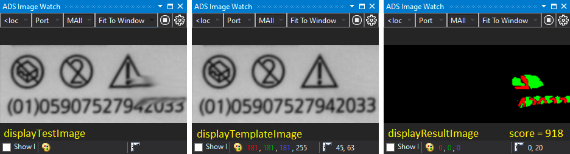

# Code Snippet - Golden Template using TwinCAT Vision

What is a code snippet? These are mini blocks of code which help me to remember and reuse parts of Infosys.  
These are not "Wow" level examples. They are just ultra simple, copy paste code. But as always, I like to share.

## Disclaimer

This is a personal guide not a peer reviewed journal or a sponsored publication. We make
no representations as to accuracy, completeness, correctness, suitability, or validity of any
information and will not be liable for any errors, omissions, or delays in this information or any
losses injuries, or damages arising from its display or use. All information is provided on an as
is basis. It is the reader’s responsibility to verify their own facts.

The views and opinions expressed in this guide are those of the authors and do not
necessarily reflect the official policy or position of any other agency, organization, employer or
company. Assumptions made in the analysis are not reflective of the position of any entity
other than the author(s) and, since we are critically thinking human beings, these views are
always subject to change, revision, and rethinking at any time. Please do not hold us to them
in perpetuity.

## Overview

The Golden Template code is a set of image processing steps that compares a "test image" to a "template image" and produces a score that is the sum of the number of non-zero pixels in two binary images.

This code can be useful for tasks such as image matching, object recognition, and pattern recognition.

## Screenshot



## Code Snippets
Only code related to Golden Template is included below.  For the full code example please see the TwinCAT project.

```
PROGRAM MAIN
VAR
	// settings
	positiveThreshold : LREAL := 10;
	negativeThreshold : LREAL := -10;

	// variables
	readTestImage: FB_VN_ReadImage;
	readTemplateImage: FB_VN_ReadImage;
	result : HRESULT := S_OK;
	testImage : ITcVnImage;
	templateImage : ITcVnImage;
	testImageAsMonochrome : ITcVnImage;
	templateAsMonochrome : ITcVnImage;
	testImageAsMonochromeSigned16 : ITcVnImage;
	templateImageAsMonochromeSigned16 : ITcVnImage;
	subtractedImage : ITcVnImage;
	positiveThresholdImage : ITcVnImage;
	negativeThresholdImage : ITcVnImage;
	positiveThresholdImageUSINT : ITcVnImage;
	negativeThresholdImageUSINT : ITcVnImage;
	positiveScore : ULINT;
	negativeScore : ULINT;
	score : ULINT;
END_VAR
```

```
readTestImage(
    sFilePath   :=  'C:\temp\quality-image.png',
    ipDestImage :=  testImage,
    bRead       :=  TRUE,
    nTimeout    :=  T#5S
);

readTemplateImage(
    sFilePath   :=  'C:\temp\quality-template.png',
    ipDestImage :=  templateImage,
    bRead       :=  TRUE,
    nTimeout    :=  T#5S
);

IF readTestImage.bBusy OR readTestImage.bError OR testImage = 0 THEN
    RETURN;
END_IF

IF readTemplateImage.bBusy OR readTemplateImage.bError OR templateImage = 0 THEN
    RETURN;
END_IF

result := F_VN_ConvertColorSpace(testImage,testImageAsMonochrome,TCVN_CST_RGB_TO_GRAY,result);
result := F_VN_ConvertColorSpace(templateImage,templateAsMonochrome,TCVN_CST_RGB_TO_GRAY,result);
result := F_VN_ConvertElementType(testImageAsMonochrome,testImageAsMonochromeSigned16,TCVN_ET_INT,result);
result := F_VN_ConvertElementType(templateAsMonochrome,templateImageAsMonochromeSigned16,TCVN_ET_INT,result);
result := F_VN_SubtractImages(testImageAsMonochromeSigned16,templateImageAsMonochromeSigned16,subtractedImage,result);
result := F_VN_Threshold(subtractedImage,positiveThresholdImage,positiveThreshold,255,TCVN_TT_BINARY,result);
result := F_VN_Threshold(subtractedImage,negativeThresholdImage,negativeThreshold,255,TCVN_TT_BINARY_INV,result);
result := F_VN_ConvertElementType(positiveThresholdImage,positiveThresholdImageUSINT,TCVN_ET_USINT,result);
result := F_VN_ConvertElementType(negativeThresholdImage,negativeThresholdImageUSINT,TCVN_ET_USINT,result);
result := F_VN_CountNonZeroPixels(positiveThresholdImageUSINT,positiveScore,result);
result := F_VN_CountNonZeroPixels(negativeThresholdImageUSINT,negativeScore,result);

// low score = good match, high score = bad match
score := positiveScore + negativeScore;

```

## Versions

- TcXaeShell 3.1.4024.35
- TwinCAT Vision 4.0.3.5

## Need more help?

Please visit http://beckhoff.com/ for further guides
